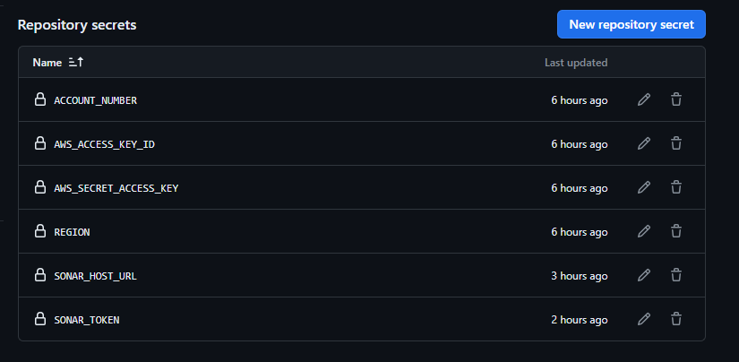

# FastAPI Endpoint

This repository contains a sample fast api written in python. The api accepts a POST request of an alphabet and then returns a name of a poet whoe first name matches the letter that is sent in the request. Payload data should look like the below

```
{
    "letter" : "p" # can be any other letter
}
```

To use this repo on the cloud ensure you set you github actions secrets with AWS credentials, AWS Account Number, Region, sonar host url, sonar token

```
ACCOUNT_NUMBER
AWS_ACCESS_KEY_ID
AWS_SECRET_ACCESS_KEY
REGION
SONAR_HOST_URL
SONAR_TOKEN
```


## Setting Up Locally

To use the API locally, navigate to the `/src` directory. Using docker compose, you can easily spin up  container running the api

```
docker compose up -d
```

It will create a container running on port 8000 which you can make local requests to using tools like postman.


## Setting Up on Cloud

Having those secret variables set in the github actions secrets, Proceed to deploy the the infra using the `deploy terraform` job in github actions. you can trigger it using a workflow diapatch that is provided in the GHA console.

The terraform script uses AWS s3 bucket to store the state backend. This is 


